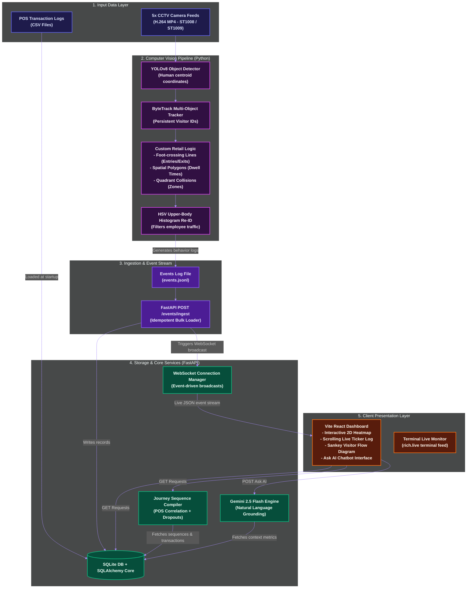

# Store Intelligence System — Retail Behavioral Analytics Pipeline

An end-to-end retail analytics pipeline that converts raw unstructured CCTV video footage and structured POS logs into real-time retail insights. Featuring a premium dark-mode React dashboard with interactive 2D floorplan heatmaps, real-time WebSocket connection logging, and custom Sankey visitor journey flow animations.

---

## File Structure

Below is the consolidated, clean root-level directory layout of the project:

```
store-intelligence-pipeline-setup/
├── app/                       # FastAPI Backend Application
│   ├── main.py                # Server Entrypoint & Router Registrations
│   ├── ask.py                 # Gemini AI Conversational Analytics Route
│   ├── flow.py                # Visitor Journey Sequence Compiler Route
│   ├── ingestion.py           # Behavioral Event Ingest & WebSocket Broadcasts
│   ├── websocket.py           # Live WebSocket Subscription Manager
│   ├── models.py              # Pydantic schemas (Ask, Flow, Ingest)
│   ├── db.py                  # POS Data Loader & Database Utilities
│   └── config.py              # Path and Env resolution config
├── dashboard-web/             # React + Tailwind CSS + Vite Frontend
│   ├── src/
│   │   ├── App.jsx            # Main Dashboard & UI Components
│   │   └── index.css          # Tailwind Directives & Custom Animations
│   ├── tailwind.config.js     # Glassmorphic Styling Configuration
│   ├── postcss.config.js      # PostCSS Configuration
│   ├── package.json           # Frontend Dependencies (Recharts, Lucide, etc.)
│   └── vite.config.js         # Vite configuration
├── pipeline/                  # Computer Vision Tracking Pipelines
│   ├── detect_store_2.py      # Store 2 (Phoenix Marketcity) CV Pipeline
│   ├── cam_entry_store_2.py   # Store 2 Entrance crossing logic
│   ├── cam_zones_store_2.py   # Store 2 Quadrant collision checking
│   ├── cam_billing.py         # Checkout queue tracker
│   ├── run_store_2.sh         # Store 2 pipeline orchestrator
│   └── run.sh                 # Store 1 pipeline orchestrator
├── data/                      # Local Data Storage
│   ├── pos_transactions.csv   # Store 1 POS data
│   └── store_2_pos_transactions.csv # Store 2 POS data
├── tests/                     # Automated Test Suites
│   ├── test_ask.py            # AI Conversational Query tests
│   ├── test_flow.py           # Sankey journey sequence compiler tests
│   └── test_websocket.py      # Real-time WebSocket transmission tests
├── .env                       # Environment Variables (Gemini API Key, local DB, etc.)
├── store_intelligence.db      # Local Persistent SQLite database
├── requirements.txt           # Python backend dependencies
├── Dockerfile                 # Backend container definition
└── docker-compose.yml         # Local orchestration file
```

---

## Quick Start (4 commands)

To spin up the system locally:

```bash
git clone https://github.com/Romkar2006/Store_Inteligence.git
cd Store_Inteligence
cp data/sample.env .env
docker compose up --build -d
```

Visit the API metrics: [http://localhost:8000/stores/ST1008/metrics](http://localhost:8000/stores/ST1008/metrics)

If you are working inside this workspace directory locally, use:

```powershell
cd "C:\Users\Victus\OneDrive\Desktop\purple_tech\store-intelligence-pipeline-setup"
docker compose up --build -d
```

---

## System Architecture

The complete system operates as an event-driven retail behavioral processing pipeline:



### Core Architecture Components

1. **Unstructured Data Ingestion (CCTV)**: The pipeline processes high-definition H.264 camera footage. Centroids of detected humans are monitored continuously. Timestamps are computed in Indian Standard Time (IST, UTC+5:30) to remain fully aligned.
2. **Object Tracking & Re-ID**: ByteTrack assigns persistent IDs. An HSV upper-body color histogram extractor runs cosine similarity checks to classify store staff, filtering out their events so analytics metrics remain accurate.
3. **Behavioral Inference**: Foot-crossing lines and polygon overlaps determine entry, exit, and dwell times per zone. Queue join and abandon algorithms track billing metrics.
4. **Idempotent Ingestion Service**: The FastAPI `/events/ingest` endpoint filters duplicates and saves unique events in SQLite. It instantly triggers background WebSocket broadcasts to notify all connected dashboards.
5. **Visitor Journey Compiler (Sankey Flow)**: Resolves the chronological flow of visitors across store zones (`Entry` → `Skincare/Navigation` → `Makeup` → `Billing` → `Exit`). It checks POS transactions within a 5-minute checkout window to classify "Billing" conversions vs. dropouts.
6. **AI Grounding Engine**: Integrates Google Gemini 2.5 Flash API with local SQLite contexts to answer analytical questions in plain English, with a rule-based regex engine serving as a fallback.

---

## Live Web Dashboard (React + Vite)

The upgraded dashboard serves as a premium, real-time command center:

```bash
# Navigate to the dashboard
cd dashboard-web

# Install packages & launch dev server
npm install
npm run dev
```

Visit the dashboard: **http://localhost:5173**

### Key Features:
- **Dual-Store Support**: Click-toggle layouts and statistics between Brigade Road (`ST1008`) and Phoenix Marketcity (`ST1009`).
- **Interactive 2D Floorplan Heatmap**: Dynamically colors retail zones according to dwell times, complete with hover stats and click inspections.
- **WebSocket Streaming Event Ticker**: Displays live connection status and scrolls newly processed raw events as they occur.
- **Animated Sankey Visitor Flow**: Visualizes customer conversions and dropouts using curved SVG ribbons with flowing particle animations.
- **Conversational Ask AI Chat Panel**: Submit natural language queries directly inside the sidebar, featuring quick-suggestion chips and glowing model grounding badges.

---

## API Endpoints Reference

| Route | Method | Description |
|---|---|---|
| `/stores/{store_id}/metrics` | GET | Unique visitors, conversion rate, and average dwell times |
| `/stores/{store_id}/funnel` | GET | Entry → Zone Visit → Billing Queue → Purchase funnel data |
| `/stores/{store_id}/heatmap` | GET | Normalized zone heat values (0–100) for layouts |
| `/stores/{store_id}/flow` | GET | Node and link transition counts for Sankey diagram |
| `/stores/{store_id}/anomalies` | GET | Queue depth alerts, dead zones, and conversion drop metrics |
| `/stores/{store_id}/ask` | POST | Ask natural language questions (Gemini AI RAG / Fallback rules) |
| `/stores/{store_id}/ws` | WebSocket | Real-time event notifications stream |
| `/events/ingest` | POST | Ingest bulk events (idempotent, triggers WS broadcasts) |
| `/health` | GET | Service status and camera feed staleness check |

---

## Cloud Deployment

### Frontend Deployment (Vercel)
1. Link your repository to Vercel.
2. In the project settings, change the **Root Directory** to `dashboard-web`.
3. Add the Environment Variable `VITE_API_BASE` set to your public FastAPI endpoint (e.g., `https://your-api.onrender.com`).
4. Click **Deploy**.

### Backend Deployment (Render / Railway)
1. Create a Web Service pointing to your repository.
2. Leave the **Root Directory** field blank (build directly from the repository root).
3. Set **Build Command** to `pip install -r requirements.txt`.
4. Set **Start Command** to `python -m uvicorn app.main:app --host 0.0.0.0 --port 10000`.
5. Define the environment variables:
   - `DB_PATH` = `store_intelligence.db`
   - `POS_CSV_PATH` = `data/pos_transactions.csv`
   - `GEMINI_API_KEY` = `your-google-gemini-api-key`
6. Click **Deploy**.
