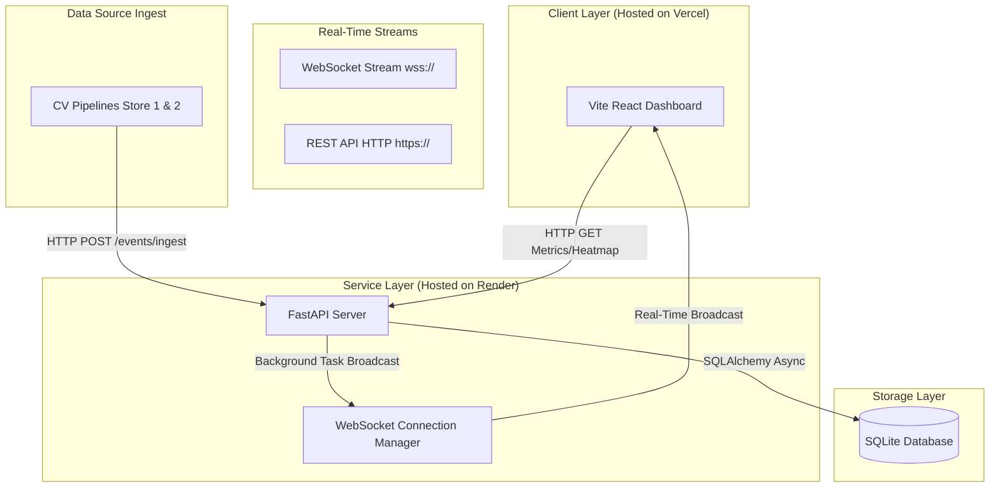

# Store Intelligence System — Purplle Brigade Road (ST1008)

End-to-end retail analytics pipeline: raw CCTV footage → behavioral events → real-time FastAPI analytics.

## Quick Start (5 commands)

```bash
git clone https://github.com/YOUR_USERNAME/store-intelligence.git
cd store-intelligence
cp data/sample.env .env
docker compose up --build -d
bash pipeline/run.sh
```

Visit: http://localhost:8000/stores/ST1008/metrics

If you are working inside this workspace, use the project root directly:

```powershell
cd "C:\Users\Victus\OneDrive\Desktop\purple_tech\store-intelligence-pipeline-setup\store-intelligence"
docker compose up --build -d
```

Do not run `uvicorn app.main:app` from the parent `purple_tech` folder. The `app` package lives inside the `store-intelligence` project root.

## Prerequisites

- Docker Desktop installed and running
- Python 3.11+ (for running pipeline outside Docker)
- Camera footage files placed in data/ (see data/README.md)

## Docker Setup

The recommended process is Docker Compose from the `store-intelligence` project root. That keeps the API, SQLite volume, and input data paths aligned with the container paths used in `Dockerfile` and `docker-compose.yml`.

```powershell
cd "C:\Users\Victus\OneDrive\Desktop\purple_tech\store-intelligence-pipeline-setup\store-intelligence"
docker compose up --build -d
docker compose ps
curl -sS http://127.0.0.1:8000/health
```

## Setup Data Files

```bash
# Rename and place POS data
cp /path/to/Brigade_Bangalore_10_April_26.csv data/pos_transactions.csv

# Place camera files
cp /path/to/CAM_*.mp4 data/
```

## Run the Detection Pipeline

```bash
# Processes all 5 cameras, generates events.jsonl
bash pipeline/run.sh

# Expected output: ~330 events in events.jsonl
# Event types: ENTRY, EXIT, ZONE_ENTER, ZONE_EXIT,
#              ZONE_DWELL, BILLING_QUEUE_JOIN,
#              BILLING_QUEUE_ABANDON
```

## Run Tests

```bash
pip install -r requirements.txt
pytest tests/ -v --tb=short
# Expected: 26 passed, 84% coverage
```

## Live Dashboard (Bonus)

```bash
python dashboard/live_dashboard.py \
	--events events.jsonl \
	--store ST1008
```

## API Endpoints

| Endpoint | Description |
|----------|-------------|
| GET /stores/{store_id}/metrics | Unique visitors, conversion rate, zone dwell |
| GET /stores/{store_id}/funnel | Entry → Zone → Billing → Purchase |
| GET /stores/{store_id}/heatmap | Zone heat scores normalised 0–100 |
| GET /stores/{store_id}/anomalies | Queue spikes, conversion drops, dead zones |
| POST /stores/{store_id}/ask | Natural Language Query AI grounding (Gemini RAG / Fallback rules) |
| GET /health | Service status, stale feed detection |
| POST /events/ingest | Batch event ingestion (idempotent) |

## Expected Output Note

The provided clips are a ~2-minute window (20:10–20:12 IST).
The nearest POS transaction falls 13 minutes outside this window.
The system correctly returns conversion_rate: 0.0 for this window.
A full production deployment with day-long feeds would show real conversion data.

## System Architecture

The Store Intelligence System operates as an asynchronous, event-driven pipeline that converts raw unstructured video footage and structured POS logs into real-time retail insights:

```text
 ┌────────────────────────────────────────────────────────────────────────┐
 │                              INPUT SOURCES                             │
 │  ┌───────────────────────┐                  ┌───────────────────────┐  │
 │  │ 5x CCTV Camera Feeds  │                  │  POS Transactions CSV │  │
 │  │ (CAM_1 to CAM_5 - MP4)│                  │ (pos_transactions.csv)│  │
 │  └───────────┬───────────┘                  └───────────┬───────────┘  │
 └──────────────┼──────────────────────────────────────────┼──────────────┘
                ▼                                          ▼
 ┌────────────────────────────────────────────────────────────────────────┐
 │                       COMPUTER VISION PIPELINE                         │
 │  ┌──────────────────────────────────────────────────────────────────┐  │
 │  │             YOLOv8 Detector + ByteTrack Object Tracking          │  │
 │  └──────────────────────────────────┬───────────────────────────────┘  │
 │                                     ▼                                  │
 │  ┌──────────────────────────────────────────────────────────────────┐  │
 │  │                    Custom Retail Logic Blocks                    │  │
 │  │  - CAM_3 (Entry Mat): Mat Crossing Foot-Tracker (y=580)          │  │
 │  │  - CAM_1 & 2 (Zone Dwelling): cv2.pointPolygonTest overlap       │  │
 │  │  - CAM_4 (Stockroom): HSV Upper-Body Feature Extractor (Re-ID)   │  │
 │  │  - CAM_5 (Billing Queue): Queue join/abandon tracker             │  │
 │  └──────────────────────────────────┬───────────────────────────────┘  │
 └─────────────────────────────────────┼──────────────────────────────────┘
                                       ▼
 ┌────────────────────────────────────────────────────────────────────────┐
 │                             INGESTION STREAM                           │
 │  ┌──────────────────────────────────────────────────────────────────┐  │
 │  │                Structured JSON Events (events.jsonl)             │  │
 │  └──────────────────────────────────┬───────────────────────────────┘  │
 │                                     ▼                                  │
 │  ┌──────────────────────────────────────────────────────────────────┐  │
 │  │                    FastAPI POST /events/ingest                   │  │
 │  └──────────────────────────────────┬───────────────────────────────┘  │
 └─────────────────────────────────────┼──────────────────────────────────┘
                                       ▼
 ┌────────────────────────────────────────────────────────────────────────┐
 │                      STORAGE & ANALYTICS PORTAL                        │
 │  ┌──────────────────────────────────────────────────────────────────┐  │
 │  │                    SQLAlchemy Database Service                   │  │
 │  └──────────────────────────────────┬───────────────────────────────┘  │
 │                                     ▼                                  │
 │  ┌──────────────────────────────────────────────────────────────────┐  │
 │  │                Persistent SQLite Volume (store_intelligence.db)  │  │
 │  └──────────────────────────────────┬───────────────────────────────┘  │
 │                                     ▼                                  │
 │  ┌──────────────────────────────────────────────────────────────────┐  │
 │  │                REST API Get Analytics Endpoints                  │  │
 │  │                - /metrics, /funnel, /heatmap, /anomalies         │  │
 │  └──────────────────────────────────┬───────────────────────────────┘  │
 └─────────────────────────────────────┼──────────────────────────────────┘
                                       ▼
 ┌────────────────────────────────────────────────────────────────────────┐
 │                             CLIENT ACCESS                              │
 │  ┌───────────────────────┐                  ┌───────────────────────┐  │
 │  │  Rich Terminal UI     │                  │   Local Browser View  │  │
 │  │  (live_dashboard.py)  │                  │  (Metrics/Funnel APIs)│  │
 │  └───────────────────────┘                  └───────────────────────┘  │
 └────────────────────────────────────────────────────────────────────────┘
```

### Core Architecture Components
1. **Unstructured Data Ingestion**: The system consumes H.264 compressed MP4 retail camera video clips. All timestamps are localized to Indian Standard Time (IST, UTC+5:30) to prevent clock drift.
2. **Object Detection & Re-ID**: YOLOv8 is used for robust human detection. Upper-body crop HSV color histograms are compiled on stockroom tracks (CAM_4) to uniquely identify employees and filter them out of consumer metric evaluations using cosine similarity.
3. **Behavioral Inference**: Custom geometry modules run foot-tracking intersection metrics (for entries/exits) and spatial polygon checks (for zone dwell times) on human tracks.
4. **Idempotent Storage**: FastAPI digests event batches, verifies event ID uniqueness, and stores records in SQLite via SQLAlchemy Core, updating KPIs dynamically.
5. **Real-time REST APIs**: Serving metrics, heatmaps, operational anomalies (like queue depth warnings), and drop-off funnels to clients.
6. **Live Terminal Monitor**: Uses `rich.live` to fetch API state and replay ingested logs at 10x speed.
7. **Live Web Dashboard**: Real-time React + Tailwind CSS dashboard with live zone heatmaps, WebSockets stream integration, simulated CCTV matrix, and dual-store support.

## Live Web Dashboard (Upgraded)

The dashboard has been upgraded from a basic polling client to a premium, real-time analytics command center:

```bash
# Go to dashboard directory
cd dashboard-web

# Install dependencies and start the Vite dev server
npm install
npm run dev
```

Visit: **http://localhost:5173**

### Premium Dashboard Features:
- **Dual-Store Analytics**: Dynamically toggles layouts, stats, and CCTV streams between Brigade Road (`ST1008` / Store 1) and Phoenix Marketcity (`ST1009` / Store 2).
- **Sub-Second WebSocket Ingest Log**: Connects via `wss://` / `ws://` to log newly processed events in real-time, instantly repainting metrics and heat scores without page refreshes.
- **Interactive 2D Floorplan Heatmap**: Dynamically color-codes retail zones based on normalized average dwell times. Features hover detail cards and click-to-inspect zone analysis.
- **Simulated CCTV Video Feeds Matrix**: A 2x2 surveillance monitoring grid showing camera labels, active object detections, confidence indices, and warning alarms (e.g. flashing **"QUEUE SPIKE"** flags on the checkout camera).
- **Staff ReID Activity Monitor**: A dedicated sidebar panel tracking staff classifications, ReID model template checks, and a live progress indicator mapping customer vs. staff event ratios.
- **Advanced Recharts Integration**: Interactive area charts mapping shopper conversion funnels (`ENTRY` → `ZONE_VISIT` → `BILLING_QUEUE` → `PURCHASE`) and horizontal bar charts mapping average dwells.
- **Conversational Ask AI Analytics**: A sleek panel in the dashboard sidebar to ask operational questions in plain English (e.g., "Which zone had the most traffic today?"). Integrates automatic scrolling, suggestion chips, loading states, and glowing grounding badges.

---

## System Architecture (Real-Time Web Dashboard)

Once the Live Web Dashboard and WebSocket broadcasters are deployed, the end-to-end data flow operates as follows:



### Key Production Enhancements:
1. **Dynamic Environment Configuration**: The React frontend dynamically loads the hosted backend address via `VITE_API_BASE`.
2. **Auto-Deriving WebSocket Channels**: The client automatically extracts the domain name and securely negotiates the protocol (falling back to secure `wss://` on HTTPS and standard `ws://` on local HTTP).
3. **Structured Analytics logging**: The FastAPI backend records trace IDs, endpoint latency, status codes, and batch ingestion stats in a structured JSON format (`structlog`).
4. **Resilient Error Boundaries**: Incorporates database outage checks returning `503 Service Unavailable` and structured error responses.

---

## Cloud Deployment (Production Ready)

### Frontend Deployment (Vercel)
1. Link your GitHub repository to Vercel.
2. Set the **Root Directory** settings to `dashboard-web`.
3. Add the environment variable `VITE_API_BASE` set to your public API URL (e.g., `https://your-api.onrender.com`).
4. Click **Deploy**.

### Backend Deployment (Render / Railway)
1. Create a Web Service pointing to your repository.
2. Leave the **Root Directory** field blank (build directly from the root).
3. Set **Build Command** to `pip install -r requirements.txt`.
4. Set **Start Command** to `python -m uvicorn app.main:app --host 0.0.0.0 --port 10000`.
5. Add the environment variables:
   - `DB_PATH` = `store_intelligence.db`
   - `POS_CSV_PATH` = `data/pos_transactions.csv`
   - `GEMINI_API_KEY` = `your-google-gemini-api-key`
6. Click **Deploy**.

---

See docs/DESIGN.md for full architecture and AI-assisted decisions.
See docs/CHOICES.md for engineering trade-off reasoning.


