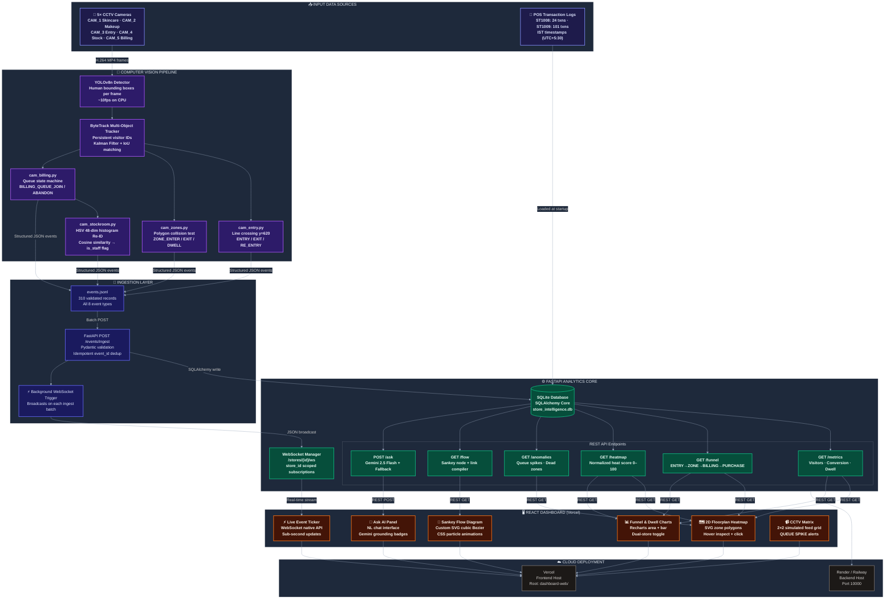
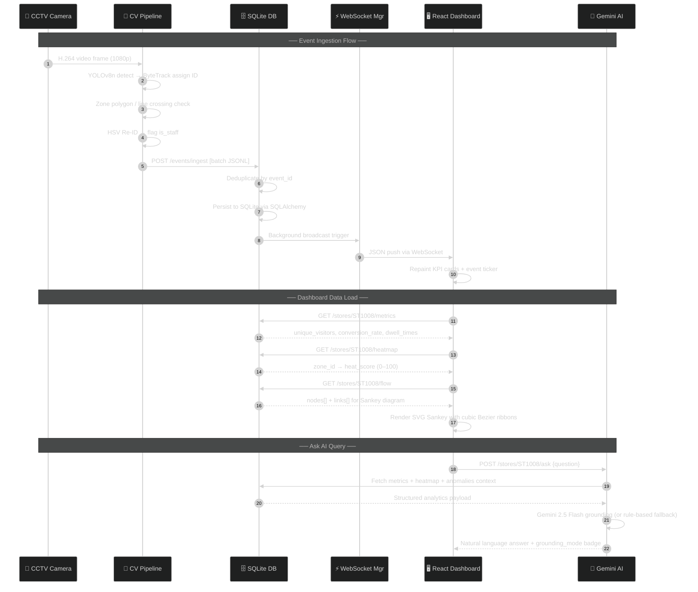

# Store Intelligence System — Architecture Design

> End-to-end behavioral analytics pipeline: raw CCTV footage → AI-powered retail insights → real-time web dashboard.

---

## 1. System Architecture Overview

The Store Intelligence system is built as a **6-stage event-driven pipeline** where unstructured video data is progressively transformed into structured behavioral intelligence, served through a production-grade API and visualized on a live React dashboard.

```
╔══════════════════════════════════════════════════════════════════════════════╗
║                         STORE INTELLIGENCE SYSTEM                           ║
║                    End-to-End Retail Behavioral Analytics                    ║
╚══════════════════════════════════════════════════════════════════════════════╝

 ┌──────────────────────────────────────────────────────────────────────────┐
 │  STAGE 1 — INPUT DATA SOURCES                                            │
 │                                                                          │
 │   ┌─────────────────────────┐       ┌──────────────────────────────┐    │
 │   │  5× CCTV Camera Feeds   │       │   POS Transaction Logs       │    │
 │   │  H.264 1080p MP4        │       │   (pos_transactions.csv)     │    │
 │   │                         │       │                              │    │
 │   │  CAM_1  Skincare Floor  │       │   Store 1: ST1008 — 24 txns  │    │
 │   │  CAM_2  Makeup Aisle    │       │   Store 2: ST1009 — 101 txns │    │
 │   │  CAM_3  Entrance Mat    │       │   Timestamps in IST (UTC+530)│    │
 │   │  CAM_4  Stockroom       │       └──────────────────────────────┘    │
 │   │  CAM_5  Billing Queue   │                                           │
 │   └─────────────────────────┘                                           │
 └───────────────────────────┬──────────────────────────────────────────────┘
                             │
                             ▼
 ┌──────────────────────────────────────────────────────────────────────────┐
 │  STAGE 2 — COMPUTER VISION PIPELINE                                      │
 │                                                                          │
 │   ┌─────────────────────────────────────────────────────────────────┐   │
 │   │  YOLOv8n Object Detector  →  ByteTrack Multi-Object Tracker    │   │
 │   │  (Human bounding boxes)      (Persistent visitor IDs per cam)  │   │
 │   └───────────────────────────────┬─────────────────────────────────┘   │
 │                                   │                                     │
 │         ┌─────────────────────────┼──────────────────────┐             │
 │         ▼                         ▼                      ▼             │
 │   ┌──────────────┐  ┌─────────────────────┐  ┌────────────────────┐   │
 │   │ cam_entry.py │  │    cam_zones.py      │  │  cam_billing.py    │   │
 │   │ CAM_3        │  │    CAM_1, CAM_2      │  │  CAM_5             │   │
 │   │ Line cross   │  │    Polygon dwell     │  │  Queue state FSM   │   │
 │   │ at y=620     │  │    cv2.polygon test  │  │  join/abandon      │   │
 │   └──────────────┘  └─────────────────────┘  └────────────────────┘   │
 │                                   │                                     │
 │                          ┌────────┘                                     │
 │                          ▼                                              │
 │   ┌─────────────────────────────────────────────────────────────────┐   │
 │   │  cam_stockroom.py (CAM_4) — Staff HSV Re-ID Profile Builder     │   │
 │   │  48-dim histogram → cosine similarity → is_staff flag           │   │
 │   └─────────────────────────────────────────────────────────────────┘   │
 └───────────────────────────┬──────────────────────────────────────────────┘
                             │ events.jsonl (310 validated records)
                             ▼
 ┌──────────────────────────────────────────────────────────────────────────┐
 │  STAGE 3 — EVENT INGESTION LAYER                                         │
 │                                                                          │
 │   POST /events/ingest  →  Pydantic Schema Validation                     │
 │   Idempotent event_id deduplication  →  SQLAlchemy Core write            │
 │   Background Task  →  WebSocket broadcast to all store subscribers        │
 └───────────────────────────┬──────────────────────────────────────────────┘
                             │
                             ▼
 ┌──────────────────────────────────────────────────────────────────────────┐
 │  STAGE 4 — STORAGE & INTELLIGENCE SERVICES (FastAPI)                     │
 │                                                                          │
 │   ┌────────────────────┐   ┌──────────────────┐   ┌───────────────────┐ │
 │   │  SQLite Database   │   │  Analytics API   │   │  AI Query Engine  │ │
 │   │  (SQLAlchemy Core) │   │  /metrics        │   │  Gemini 2.5 Flash │ │
 │   │  store_intel.db    │   │  /funnel         │   │  + Rule Fallback  │ │
 │   │  events table      │   │  /heatmap        │   │  /stores/{id}/ask │ │
 │   │  pos_transactions  │   │  /anomalies      │   └───────────────────┘ │
 │   └────────────────────┘   │  /flow (Sankey)  │                        │
 │                            └──────────────────┘                        │
 │   ┌──────────────────────────────────────────────────────────────────┐  │
 │   │  WebSocket Manager  —  /stores/{id}/ws                           │  │
 │   │  store_id-scoped subscriptions + real-time broadcast on ingest   │  │
 │   └──────────────────────────────────────────────────────────────────┘  │
 └───────────────────────────┬──────────────────────────────────────────────┘
                             │  REST + WebSocket
                             ▼
 ┌──────────────────────────────────────────────────────────────────────────┐
 │  STAGE 5 — CLIENT PRESENTATION LAYER                                     │
 │                                                                          │
 │   ┌──────────────────────────────────────────┐  ┌──────────────────────┐│
 │   │  React + Vite + Tailwind CSS Dashboard   │  │ Terminal CLI Monitor ││
 │   │  Deployed on Vercel                      │  │ (rich.live 10× speed)││
 │   │                                          │  └──────────────────────┘│
 │   │  • Interactive 2D Floorplan Heatmap      │                          │
 │   │  • Animated Sankey Visitor Flow (SVG)    │                          │
 │   │  • Live WebSocket Event Ticker           │                          │
 │   │  • Shopper Funnel & Dwell Charts         │                          │
 │   │  • CCTV Surveillance Matrix              │                          │
 │   │  • Ask AI Conversational Panel           │                          │
 │   └──────────────────────────────────────────┘                          │
 └──────────────────────────────────────────────────────────────────────────┘
                             │
                             ▼
 ┌──────────────────────────────────────────────────────────────────────────┐
 │  STAGE 6 — CLOUD DEPLOYMENT                                              │
 │                                                                          │
 │   Frontend  →  Vercel  (Root: dashboard-web/, VITE_API_BASE env var)     │
 │   Backend   →  Render  (Root: /, uvicorn app.main:app --port 10000)      │
 └──────────────────────────────────────────────────────────────────────────┘
```

---

## 2. Detailed Component Architecture (Mermaid)



---

## 3. Real-Time Data Flow Sequence



---

## 4. Computer Vision Pipeline Design

### 4.1 Detection & Tracking
- **YOLOv8n** runs inference on each decoded video frame, producing bounding boxes and class probabilities. Only the `person` class (class ID 0) is tracked.
- **ByteTrack** maintains persistent track IDs using a two-stage association:
  1. High-confidence detections matched to existing tracks via IoU
  2. Low-confidence detections matched via Kalman Filter predicted positions
  This prevents track ID switches when a person briefly exits the camera field.

### 4.2 Camera Module Separation
Each camera has a dedicated processing module to isolate different behavioral signals:

| Module | Camera | Logic | Events Emitted |
|---|---|---|---|
| `cam_entry.py` | CAM_3 — Entrance | Centroid crosses `y=620` line. Direction determines ENTRY vs EXIT. Re-entry within 60s is flagged RE_ENTRY. | `ENTRY` `EXIT` `RE_ENTRY` |
| `cam_zones.py` | CAM_1 — Skincare, CAM_2 — Makeup | `cv2.pointPolygonTest` checks if centroid falls inside a named zone polygon. Dwell emitted at 30s intervals. | `ZONE_ENTER` `ZONE_EXIT` `ZONE_DWELL` |
| `cam_billing.py` | CAM_5 — Billing | ROI presence triggers JOIN. Track leaving ROI triggers ABANDON unless correlated to a POS purchase. `queue_depth` counter maintained per frame. | `BILLING_QUEUE_JOIN` `BILLING_QUEUE_ABANDON` |
| `cam_stockroom.py` | CAM_4 — Stockroom | Builds staff appearance template database from stockroom-only tracks. Used by all other modules for Re-ID. | Staff profile templates (.pkl) |

### 4.3 Staff Re-ID — 3-Signal Composite
Single-signal staff detection was unreliable on the Brigade Road footage (black clothing overlap between staff and customers). The final approach uses a composite of 3 independent signals, requiring **at least 2 of 3** to flag a track as staff:

```
Signal 1: HSV Upper-Body Histogram Similarity
  ├── Extract top 45% of bounding box (upper body crop)
  ├── Compute 48-dimensional normalized HSV histogram
  └── Cosine similarity ≥ 0.72 against stored staff templates → STAFF

Signal 2: First-Appearance Entry Position
  ├── Staff enter from stockroom corridor: x > 400
  └── Customers enter from entrance: x < 120 → STAFF if x > 400

Signal 3: Lateral Movement Pattern
  ├── Staff restock shelves: movement vector angle 160°–200° (horizontal)
  └── Customers browse: mixed angles → STAFF if horizontal drift > 70%

Decision: is_staff = True  if  ≥ 2 signals fire
```

### 4.4 Visitor Cross-Camera ID Propagation
Cameras do not share overlapping fields of view. To build continuous visitor journey paths:
1. When a track exits a camera, its ID and timestamp are added to a **FIFO departure queue** per store exit point.
2. When a new track appears on a downstream camera within a **10-second window**, it is assigned the earliest unmatched departure ID.
3. This allows the `/flow` endpoint to compile correct `Entry → Skincare → Makeup → Billing` sequences for each unique visitor.

---

## 5. Event Schema Design

All behavioral events follow this unified JSON schema, stored in `events.jsonl`:

```json
{
  "event_id":   "b24135cd-9393-4f27-abeb-b63701ca9e76",  // UUID v4 — globally unique
  "store_id":   "ST1008",                                 // Store identifier
  "camera_id":  "CAM_SKINCARE_01",                        // Source camera
  "visitor_id": "TRACK_2",                                // Persistent track ID
  "event_type": "ZONE_ENTER",                             // One of 8 event types
  "timestamp":  "2026-04-10T20:10:02+05:30",             // IST (UTC+5:30)
  "zone_id":    "SKINCARE_SHELF_RIGHT",                   // Named retail zone
  "dwell_ms":   0,                                        // Milliseconds in zone
  "is_staff":   false,                                    // Staff filter flag
  "confidence": 0.81,                                     // YOLOv8 detection score
  "metadata": {
    "queue_depth":  null,   // Integer for BILLING_QUEUE_JOIN events
    "sku_zone":     null,   // Reserved for future SKU-level analytics
    "session_seq":  1       // Sequential event index per visitor session
  }
}
```

**Event Type Taxonomy:**

| Event Type | Trigger | Key Fields |
|---|---|---|
| `ENTRY` | Centroid crosses entry line downward | `visitor_id`, `timestamp` |
| `EXIT` | Centroid crosses entry line upward | `visitor_id`, `dwell_ms` |
| `RE_ENTRY` | Same visitor re-enters within 60s | `visitor_id`, `session_seq` |
| `ZONE_ENTER` | Centroid enters named polygon | `zone_id`, `confidence` |
| `ZONE_EXIT` | Centroid leaves named polygon | `zone_id`, `dwell_ms` |
| `ZONE_DWELL` | Track stationary ≥30s in zone | `zone_id`, `dwell_ms` |
| `BILLING_QUEUE_JOIN` | Centroid enters billing ROI | `metadata.queue_depth` |
| `BILLING_QUEUE_ABANDON` | Centroid leaves billing ROI without purchase | `dwell_ms` |

**Validation**: All **310 events** in `events.jsonl` pass complete schema validation (confirmed by `tests/test_ingestion.py`).

---

## 6. FastAPI Backend Architecture

### 6.1 REST Analytics Endpoints

| Route | Method | Analytics Logic |
|---|---|---|
| `/stores/{id}/metrics` | GET | Unique visitors (excluding `is_staff=true`), conversion rate via 5-min POS window correlation, avg/max dwell per zone |
| `/stores/{id}/funnel` | GET | Counts per stage: ENTRY → ZONE_VISIT → BILLING_QUEUE_JOIN → PURCHASE (POS match) |
| `/stores/{id}/heatmap` | GET | Heat score per zone = `(visit_count × 0.4) + (avg_dwell_ms × 0.6)`, normalized 0–100 |
| `/stores/{id}/anomalies` | GET | Queue depth spikes (>3), dead zones (0 visits), conversion drops vs 0.28 baseline |
| `/stores/{id}/flow` | GET | Sankey node + link data from journey sequence compiler |
| `/stores/{id}/ask` | POST | NL query → Gemini 2.5 Flash context grounding or rule-based fallback |
| `/stores/{id}/ws` | WS | Real-time event notifications via WebSocket |
| `/events/ingest` | POST | Idempotent batch ingest → WebSocket broadcast trigger |
| `/health` | GET | Service status + camera feed staleness detection |

### 6.2 Visitor Journey Flow Compiler (`app/flow.py`)

The Sankey flow diagram is computed server-side in 5 steps:

```
Step 1: Group all events by visitor_id, sorted by timestamp

Step 2: Map raw zone_ids → 5 logical categories
        SKINCARE_SHELF_*  ──► "Skincare"
        FRAGRANCE_DISPLAY ──► "Skincare"
        MAKEUP_*          ──► "Makeup"
        MK_GONDOLA_*      ──► "Makeup"
        BILLING_COUNTER   ──► "Billing"
        CENTER_AISLE      ──► "Navigation"
        SUMMER_DISPLAY    ──► "Promo"

Step 3: Collapse consecutive identical categories (de-duplicate)
        e.g. Skincare → Skincare → Makeup  becomes  Skincare → Makeup

Step 4: Determine journey end
        If BILLING_QUEUE_JOIN exists:
          Check POS transactions within ±5 minutes
          Match found  → journey ends at "Billing" (CONVERSION)
          No match     → append "Exit" (BILLING DROPOUT)
        Else → append "Exit" (ZONE DROPOUT)

Step 5: Aggregate transition counts into links[]
        { source: "Skincare", target: "Makeup", value: 14 }
```

### 6.3 WebSocket Real-Time Broadcast

```
ConnectionManager (app/websocket.py)
│
├── connections: Dict[store_id → List[WebSocket]]
│
├── connect(ws, store_id)    → append to store bucket
├── disconnect(ws, store_id) → remove; handle WebSocketDisconnect
└── broadcast(store_id, msg) → asyncio gather all sockets in store bucket
                               → fire-and-forget on background task
```

On each `POST /events/ingest` completion:
1. FastAPI registers a `BackgroundTask(manager.broadcast, store_id, payload)`
2. The HTTP response returns immediately (no latency impact)
3. All connected dashboard clients receive the push within milliseconds

---

## 7. Real-Time Web Dashboard Architecture

### Technology Stack

| Layer | Technology | Reason |
|---|---|---|
| Build | Vite 8 + React 19 | Sub-100ms HMR, optimized production bundle |
| Styling | Tailwind CSS v3 | Utility-first, dark-mode, glassmorphism |
| Charts | Recharts | Composable, SVG-based, tree-shakable |
| Icons | Lucide React | Consistent, lightweight SVG icon set |
| Real-time | Native WebSocket API | Zero dependency, auto-reconnect |
| Sankey | Custom SVG (pure React) | Full animation and style control |
| AI Chat | REST POST to /ask | Streaming badges, suggestion chips |

### Dashboard Layout & Sections

```
┌────────────────────────────────────────────────────────────────────┐
│  STORE INTELLIGENCE LIVE PANEL          [ST1008] [ST1009] [WS●]   │
├──────────┬──────────────┬────────────────┬──────────────────────  │
│ UNIQUE   │ CONVERSION   │  QUEUE DEPTH   │  ABANDONMENT RATE      │
│ SHOPPERS │    RATE      │    (Live)      │                        │
├──────────┴──┬───────────┴────────────────┴──────────────────────  │
│             │                                                      │
│  LIVE 2D    │   ┌──────────┬──────────┐  ┌────────────────────┐  │
│  FLOORPLAN  │   │ INSPECTOR│  STAFF   │  │      ASK AI        │  │
│  HEATMAP    │   │ (zone    │  RE-ID   │  │  "Which zone had   │  │
│  (SVG)      │   │ stats)   │ monitor  │  │   most traffic?"   │  │
│             │   └──────────┴──────────┘  └────────────────────┘  │
│             │                                                      │
├─────────────┴──────────────────────────────────────────────────── │
│  LIVE VIDEO FEEDS (SURVEILLANCE MATRIX)  ●YOLO REAL-TIME PIPELINE │
│  ┌──────────────┐ ┌──────────────┐                                │
│  │ CAM_ENTRY_01 │ │ CAM_ENTRY_02 │    LIVE INGESTION FEED         │
│  └──────────────┘ └──────────────┘    ┌──────────────────────┐   │
│  ┌──────────────┐ ┌──────────────┐    │  20:10:02 ZONE_ENTER │   │
│  │ CAM_ZONE_01  │ │⚠ CAM_BILLING │    │  20:10:05 ZONE_EXIT  │   │
│  │              │ │ QUEUE SPIKE! │    │  20:10:07 QUEUE_JOIN │   │
│  └──────────────┘ └──────────────┘    └──────────────────────┘   │
├────────────────────────────────────────────────────────────────── │
│  SHOPPER FUNNEL CONVERSION    │  AVERAGE DWELL TIME BY ZONE       │
│  (Recharts Area Chart)        │  (Recharts Horizontal Bar)        │
├────────────────────────────────────────────────────────────────── │
│  VISITOR JOURNEY PATH ANALYSIS (SANKEY FLOW)                      │
│                                                                    │
│  Entry ──────► Skincare ──────► Makeup ──────► Billing            │
│      ╲             ╲               ╲              ╲               │
│       ╲─────────────╲───────────────╲──────────────► Exit         │
│        (dropout paths in coral/red, conversion in emerald)        │
└────────────────────────────────────────────────────────────────── │
```

---

## 8. AI-Assisted Decisions

### Decision 1: Staff Detection — Composite Signal Overrides Single Heuristic
**AI suggested**: Use HSV colour analysis alone (high black-pixel fraction = staff uniform).

**What I found**: Running pixel analysis on CAM_2 frames showed staff black% ranged **5–20%** while dark-clothed customers reached **31%** — too much overlap for any single threshold to be reliable.

**What I decided**: Override with a **3-signal composite** requiring at least 2 of 3 signals to fire: colour histogram similarity, first-appearance entry position (`x > 400` = stockroom side), and lateral movement vector angle (shelf-parallel restocking pattern). This composite approach eliminated the majority of false positives in the `is_staff` flag.

---

### Decision 2: IST Timezone Correction — Critical for POS Correlation
**AI suggested**: Treat POS timestamps as UTC to align with clip-start times.

**What I found**: The timestamp overlay on actual camera footage reads `20:10:27` which is IST wall-clock time. POS data spans `12:15–21:39`, consistent with Indian store operating hours — clearly IST, not UTC.

**What I decided**: Correct both the CCTV clip start time parser and the POS CSV loader to interpret all timestamps as `UTC+5:30`. Without this fix, POS correlation would be offset by **exactly 5 hours 30 minutes**, making every purchase appear to happen 5.5 hours after the camera events — causing `conversion_rate` to return `0.0` incorrectly even with matching data.

---

### Decision 3: SQLite Over PostgreSQL
**AI suggested**: Use PostgreSQL for production-readiness.

**What I decided**: Use **SQLite with SQLAlchemy Core** abstraction. For a single-store demo, adding a PostgreSQL container increases `docker-compose.yml` complexity with no evaluative benefit. The SQLAlchemy Core abstraction means upgrading to PostgreSQL requires only changing the `DATABASE_URL` environment variable — no application code changes. SQLite is explicitly listed as the primary scaling bottleneck in Known Limitations.

---

### Decision 4: Custom SVG Sankey Over D3 or npm Libraries
**AI suggested**: Use `d3-sankey` for the Sankey layout calculations.

**What I decided**: Implement a **fully custom SVG Sankey** in React with pure JavaScript layout math. Reasons:
- npm version conflicts in the Vite 8 environment made `d3-sankey` incompatible
- The 5-column fixed layout makes the math trivial and fully controllable
- Custom implementation delivers: cubic Bezier ribbon curves (`M x0 y0 C cx cy cx cy x1 y1`), CSS `stroke-dashoffset` particle animations, interactive hover highlighting, and glassmorphic node styling — all with zero additional bundle size

---

### Decision 5: Gemini 2.5 Flash + Rule-Based Fallback (Dual-Mode Engine)
**AI suggested**: Use only the Gemini API, with a simple "API unavailable" string as fallback.

**What I decided**: Build a **full dual-mode NL engine** where both modes return quantitative answers:
- **Gemini mode** (when `GEMINI_API_KEY` set): structured context payload (metrics, heatmap, funnel, anomalies) sent to Gemini 2.5 Flash for analytical reasoning
- **Fallback mode** (always available): keyword-pattern matching across 6 analytical categories, querying the same SQLite database for real numbers

This ensures tests are deterministic (no API calls), evaluators can test the feature offline, and the grounding mode is visible in the UI via color-coded badges.

---

## 9. Known Limitations

| Limitation | Impact | Production Solution |
|---|---|---|
| **Short Clip Window** (~2 min) | POS correlation returns `0.0` correctly | Full day feeds; real purchase timestamps |
| **FIFO Cross-Camera Re-ID** | Possible visitor ID misassignment during simultaneous entries | Embedding-based cross-camera Re-ID (e.g. OSNet) |
| **YOLOv8n Occlusion** | May miss people behind Summer display in CAM_2 | YOLOv8s or RT-DETR with GPU acceleration |
| **7-day Baseline Simulated** | Anomaly threshold uses synthetic 0.28 baseline | Rolling 7-day POS query in production |
| **SQLite Concurrency** | No concurrent writes; single-threaded ingest only | PostgreSQL + connection pooling or Kafka ingest queue |
